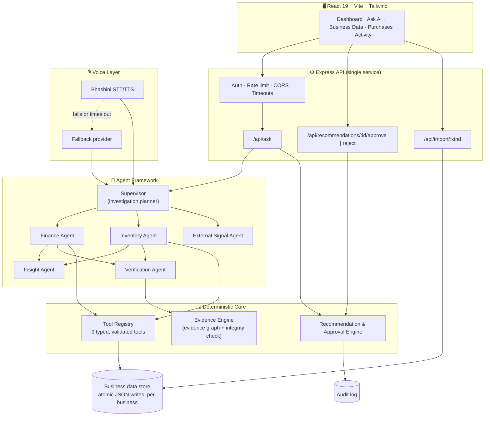
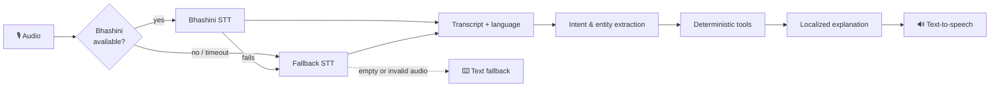

<div align="center">

# 🇮🇳 BharatBiz AI

### The business advisor every Indian shopkeeper deserves.
**Ask in Tamil, Hindi, Telugu or English → get answers proven by your own records → approve every purchase yourself.**

---

## 📌 Table of Contents

[The Problem](#-the-problem) · [Our Solution](#-our-solution) · [See It in Action](#-see-it-in-action) · [Features](#-features) · [Architecture](#-architecture) · [The Agent Team](#-the-agent-team) · [Safety by Design](#-safety-by-design) · [Voice & Languages](#-voice--languages) · [API](#-api-reference) · [Tech Stack](#-tech-stack) · [Getting Started](#-getting-started) · [Deployment](#-deployment) · [Testing](#-testing) · [Project Structure](#-project-structure) · [Roadmap](#-roadmap) · [Team](#-team)

---

## 🛒 The Problem

India's small retailers (kirana stores, grain merchants, local wholesalers) run on thin margins. A single bad purchasing decision, like **over-ordering a product that has stopped selling**, can freeze working capital and spoil stock, and the owner often only notices when profit has already dropped.

Today's tools fail them:

| Gap | Why it hurts |
|---|---|
| **English-first dashboards** | Most owners think and speak in Tamil, Hindi, Telugu or other regional languages |
| **Charts without answers** | "Profit is down" doesn't tell you *why* or *what to do* |
| **Chatbots that guess** | An LLM that makes up a number can cost a small shop real money |
| **Automation without consent** | Auto-ordering stock with no human check is a risk no shopkeeper should take |

## 💡 Our Solution

**BharatBiz AI** is a multilingual business decision assistant that turns a shop's own **sales, inventory and expense records** into **evidence-backed recommendations**, and drafts **purchase orders that only exist once the owner approves them.**

> **Our design principle:** *Software does the maths. Specialist agents investigate. The human makes the call.*

- 🧮 **Every number is computed by tested, deterministic code.** The language layer never invents figures.
- 🔎 **Every answer shows its working:** the formula, the source ledger and the evidence quality.
- ✋ **Nothing is ordered until the owner clicks Approve.** Every decision is audit-logged.

## 🎬 See It in Action

> **Owner asks:** *"Why did my profit fall this month?"* (or the same in Tamil, Hindi or Telugu)

| Step | What BharatBiz AI does |
|---|---|
| **1. Plan** | A Supervisor agent classifies the question and decides which specialists to call |
| **2. Investigate** | Finance and Inventory agents compute revenue, expense and profit deltas and find the slowest-moving product |
| **3. Verify** | A Verification agent checks the evidence chain and labels it `VERIFIED`, `PARTIAL` or `INSUFFICIENT_DATA` |
| **4. Explain** | The owner gets a plain-language explanation, the exact formulas and the full agent trail |
| **5. Recommend** | A proposed purchase correction appears: *"Reduce the next order for Product X to N units"* |
| **6. Decide** | The owner **approves or rejects**. Approval creates the purchase order and an audit entry |

<!-- Add 3 screenshots here: Ask AI answer · Approval card · Activity/audit log -->

## ✨ Features

| | Feature | Details |
|---|---|---|
| 🗣️ | **4-language support** | English, Hindi (हिन्दी), Tamil (தமிழ்), Telugu (తెలుగు) intents, entities and localized explanations |
| 🎙️ | **Voice pipeline** | Bhashini speech-to-text with automatic fallback to browser speech, plus text fallback when audio fails |
| 🤖 | **Multi-agent investigation** | Supervisor plans; Finance, Inventory, External Signal, Insight and Verification agents each own one job |
| 🧮 | **Deterministic analytics** | Profit, expense and revenue deltas, slow-mover detection, low-stock alerts and reorder quantities are computed by code, not generated |
| 🧾 | **Evidence you can audit** | Each finding carries IDs, source ledger, formula and a `VERIFIED / PARTIAL / INSUFFICIENT_DATA` status |
| ✅ | **Approval-gated actions** | Recommendations stay `PENDING` until a human approves, and a resolved decision can't be replayed |
| 📜 | **Complete audit trail** | Every question, recommendation, approval and rejection is logged per business |
| 📂 | **Safe CSV import** | RFC-4180 parser with schema validation, preview-before-save, and duplicate/invalid row rejection |
| 📊 | **Owner dashboard** | Revenue, expenses, profit, inventory value, monthly trend and an inventory watch list |
| 📥 | **One-click report** | Download any answer with its evidence as a report |
| 🔐 | **Multi-tenant auth** | Sign-up and login with scrypt-hashed passwords, HTTP-only cookies, per-business data isolation |
| 🛡️ | **Production hardening** | Rate limiting, request timeouts, CORS allow-list, health endpoints, safe error handling |

## 🏗️ Architecture



**How a request flows**

1. **Secure in:** the request passes authentication, rate limiting and tenant scoping.
2. **Plan:** the Supervisor selects an investigation (`PROFIT_DROP_ANALYSIS`, `INVENTORY_HEALTH_ANALYSIS` or `GENERAL_BUSINESS_HEALTH`) and the agents it needs.
3. **Investigate:** specialist agents call typed tools that read the business's own ledgers.
4. **Verify:** the Verification agent confirms the evidence chain before any recommendation is issued.
5. **Respond:** the owner gets an explanation, formulas, an agent trail and (if warranted) a **pending** purchase order.
6. **Act with consent:** approval creates the order and logs it. Rejection logs it too.

**Why a single service?** No Kubernetes, no agent workers, no GPUs and no self-hosted models. A small business tool should be cheap to run, so BharatBiz deploys as one Node service.

## 🤖 The Agent Team

| Agent | Responsibility | Output |
|---|---|---|
| 🧭 **Supervisor** | Reads the question (in any supported language), picks the investigation type and the agents to run | Investigation plan with ID and steps |
| 💰 **Finance** | Compares profit, revenue and expenses across periods; finds the top expense contributor | `profit_delta`, `expense_delta` findings |
| 📦 **Inventory** | Detects slow-moving products (≥25% velocity drop), low stock, and computes the reorder quantity | `slow_moving_product`, `reorder_quantity`, `low_stock_items` |
| 🌐 **External Signal** | Pluggable slot for outside context (prices, seasonality). Reports honestly when no provider is configured | `external_context` (`PARTIAL` until connected) |
| 💡 **Insight** | Correlates finance and inventory findings into a plain-language cause | `correlated_insight` |
| ✅ **Verification** | Validates that every claim traces to ledger evidence; downgrades confidence if data is missing | `VERIFIED` / `INSUFFICIENT_DATA` |

### Deterministic Tool Registry

Every tool is typed, validated and returns timing and error metadata. Unknown tools and bad parameters fail safely.

| Tool | Purpose |
|---|---|
| `calculate_profit` | Revenue, expenses, net profit and margin for one period |
| `calculate_profit_change` | Current vs previous period profit, revenue and expense deltas |
| `analyze_expense_change` | Category-level expense surges (purchase cost, wastage, delivery) |
| `detect_slow_moving_products` | Products whose weekly sales velocity dropped past a threshold |
| `detect_low_stock` | Items at or below reorder level, with deficit and days of supply |
| `calculate_reorder_quantity` | Optimised order size that preserves capital for slow movers |
| `get_sales` · `get_inventory` · `get_expenses` | Filtered ledger reads |

## 🛡️ Safety by Design

| Guarantee | How it's enforced |
|---|---|
| **No fabricated numbers** | All financial figures come from deterministic services. Responses show formula and source |
| **No action without consent** | Recommendations are created as `PENDING`. A purchase order is only written on explicit approval |
| **No double-decisions** | Approving or rejecting an already-resolved recommendation returns `409` |
| **Honest uncertainty** | Missing or unsupported data yields `INSUFFICIENT_DATA` or a safe response, never a guess |
| **Tenant isolation** | Every read and write is scoped to the authenticated user's business, and cross-tenant access returns `404` |
| **Full auditability** | Questions, recommendations, approvals and rejections are all logged with user and timestamp |
| **Credentials stay out of code** | Secrets are loaded from environment variables only, and `.env*` is git-ignored |
| **Hardened API** | Rate limiting, 2 MB body cap, request timeouts, CORS allow-list, scrypt password hashing, HTTP-only cookies |

## 🎙️ Voice & Languages



- **Languages:** English, हिन्दी, தமிழ், తెలుగు. Queries, product names (e.g. அரிசி, चावल, పప్పు) and phrasing are understood across all four.
- **Resilient by design:** Bhashini (India's national language AI platform) is the primary provider. On timeout (4 s), missing credentials or failure, the system cascades to a fallback and finally to text input.
- **Out-of-scope guard:** off-topic questions (weather, cricket, movies) get a safe refusal instead of a hallucination.

## 🔌 API Reference

All `/api/*` routes except health and auth require a logged-in session.

| Method | Endpoint | Purpose |
|---|---|---|
| `GET` | `/health` · `/api/health` | Liveness and status |
| `POST` | `/api/auth/signup` · `/login` · `/logout` | Account and session management |
| `GET` | `/api/auth/me` | Current user and business |
| `GET` | `/api/dashboard` | Metrics, monthly trend, slow-moving products |
| `GET` | `/api/data` | The business's stored records |
| `POST` | `/api/import/:kind` | Import `sales`, `inventory`, `expenses`, `purchases` or `invoices` |
| `POST` | `/api/ask` | Ask a question → explanation, evidence, agent trail, pending recommendation |
| `GET` | `/api/recommendations` | List recommendations |
| `POST` | `/api/recommendations/:id/approve` | Approve → creates purchase order and audit entry |
| `POST` | `/api/recommendations/:id/reject` | Reject → audit entry |
| `GET` | `/api/purchase-orders` | Approved purchase orders |
| `GET` | `/api/audit` | Audit trail |

## 🧰 Tech Stack

| Layer | Technology |
|---|---|
| **Frontend** | React 19, Vite, Tailwind CSS v4, Motion, Lucide icons |
| **Backend** | Node.js 20+, Express 4, `express-rate-limit`, `cors` |
| **Language** | TypeScript end-to-end, run with `tsx` |
| **Agents and logic** | Custom agent framework and a typed deterministic tool registry |
| **Voice** | Bhashini (STT/TTS) with fallback provider |
| **Persistence** | Per-business JSON store with atomic writes |
| **Auth** | scrypt password hashing, HTTP-only session cookies |
| **Deploy** | Single Render web service (`render.yaml`) |

## 🚀 Getting Started

**Prerequisite:** Node.js 20+

```bash
git clone https://github.com/aarushii-create/BharatBiz.git
cd BharatBiz
cp .env.example .env      # then fill in your own values
npm install
```

**Run locally** (frontend on `:3000`, API on `:4000`)

```bash
npm run dev
```

> 💡 `npm run dev` includes a Windows-only port-cleanup step. On macOS or Linux, run the two processes directly:
> ```bash
> npx concurrently --kill-others "npm run server" "vite --port=3000 --host=0.0.0.0"
> ```

Open **http://localhost:3000**, create a business account, then upload your CSVs from the **Business data** tab (or run the optional seed scripts below) and head to **Ask AI**.

### Configuration

| Variable | Purpose |
|---|---|
| `PORT` · `HOST` · `NODE_ENV` | Runtime settings |
| `APP_URL` · `FRONTEND_URL` · `CORS_ORIGIN` | Production URLs and CORS allow-list |
| `SESSION_SECRET` · `JWT_SECRET` | Use long random values |
| `COOKIE_SECURE` · `COOKIE_SAME_SITE` | Cookie policy |
| `DATA_DIR` · `BB_DATA_PATH` | Where business data is stored |
| `BHASHINI_API_KEY` · `BHASHINI_USER_ID` | Enables Bhashini voice (optional) |
| `GEMINI_API_KEY` · `AI_PROVIDER` · `LLM_TIMEOUT_MS` · `LLM_MAX_RETRIES` | LLM provider configuration |
| `RATE_LIMIT_WINDOW_MS` · `RATE_LIMIT_MAX_REQUESTS` · `REQUEST_TIMEOUT_MS` | API protection |
| `LOG_LEVEL` · `LOG_FORMAT` · `ENABLE_REQUEST_LOGGING` | Observability |

### Data setup

```bash
npm run db:migrate           # validate / update the data structure (manual)
npm run db:seed:test-data    # sample data for testing (manual)
npm run db:seed:demo         # demo data (manual, refuses to run in production)
```

Seed scripts **never run automatically** on startup.

### CSV import schemas

| Dataset | Required columns |
|---|---|
| **Sales** | `id, date, productId, productName, category, quantity, unitPrice, totalRevenue, period` |
| **Inventory** | `id, productId, productName, category, currentStock, reorderLevel, purchasePrice, sellingPrice, salesVelocityUnitsPerWeek` |
| **Expenses** | `id, date, category, amount, period` |
| **Purchases** | `id, date, supplierName, productId, productName, quantity, unitPrice, totalCost` |

Expense categories: *Purchase Cost, Wastage, Delivery Expense, Rent, Electricity, Packaging, Other.*

## ☁️ Deployment

One command set, one service:

```bash
npm run build:prod   # type-check + production build
npm run start:prod   # serves the built frontend and the API together
```

`render.yaml` is included for one-click deploys on Render. Secrets (`SESSION_SECRET`, `JWT_SECRET`) are auto-generated, and health checks live at `/api/health`.

## 🧪 Testing

```bash
npm run lint    # TypeScript type-check
npm test        # full verification suite
```

**Latest run: 136 tests passed, 0 failed** (see [TEST_REPORT.md](TEST_REPORT.md)).

| Suite | What it proves |
|---|---|
| Business data layer | Revenue, expense, profit and reorder maths are correct and validated |
| Orchestrator | Intent and tool selection across languages, unsupported-query handling |
| Evidence engine | Evidence graph lineage and integrity verification |
| Voice | Bhashini timeout, fallback cascade, empty or invalid audio |
| Upload | CSV validation, duplicates, negative values, empty datasets |
| Approval | No action without consent, audit records, approved-action issuance |
| Reliability and hardening | Edge cases, database failure handling, malformed input |
| Product flow | API-backed end-to-end flow, tenant isolation, persistent imports |
| Agent framework | Planning and specialist-agent coordination |

## 📁 Project Structure

```
BharatBiz/
├── server/
│   └── index.ts              # Express API: auth, tenants, ask, approvals, audit
├── src/
│   ├── App.tsx               # Dashboard · Ask AI · Data · Purchases · Activity
│   ├── agents/               # supervisor, finance, inventory, external, insight, verification
│   ├── services/
│   │   ├── toolRegistry.ts   # 9 deterministic tools + safe dispatcher
│   │   ├── businessAnalytics.ts / deterministicAnalytics.ts
│   │   ├── orchestrator.ts / aiOrchestrator.ts   # multilingual intent + explanations
│   │   ├── evidenceEngine.ts # evidence graph + integrity checks
│   │   ├── recommendationEngine.ts               # approval-gated actions
│   │   ├── voice/            # Bhashini + fallback + audio playback
│   │   └── upload/           # CSV parser, ingestion, invoice processing
│   ├── db/                   # repository, validation, seed data
│   ├── types/                # shared domain types
│   └── tests/                # 136-test verification suite
├── scripts/                  # db-migrate, seed-test-data, seed-demo-data
├── data/                     # data store location
└── render.yaml               # single-service deployment config
```

## 🗺️ Roadmap

**Built and tested t**
- ✅ Multi-agent investigation with evidence verification
- ✅ Deterministic analytics, approval gate and audit trail
- ✅ Multi-tenant auth, CSV import and dashboard
- ✅ Four-language intent handling and a resilient voice pipeline

**Next**
- 🔜 In-app microphone and voice playback in the web UI
- 🔜 Live external signals (commodity prices, seasonality) through the External Signal agent
- 🔜 Real invoice OCR (photo of a supplier bill → structured expense)
- 🔜 LLM-assisted natural phrasing with the deterministic engine still the only source of numbers
- 🔜 WhatsApp interface, since that's where shopkeepers already are
- 🔜 More languages (Marathi, Bengali, Kannada, Gujarati) and a managed database

## 👥 Team

| Name | GitHub |
|---|---|
| Aarushi Sharma | [@aarushii-create](https://github.com/aarushii-create) |
| Yojitha Boyina  | *(handle)* |


**Built so every shopkeeper can have a smart, honest business partner in their own language.** 🙏

*Evidence first. Human in control.*

</div>